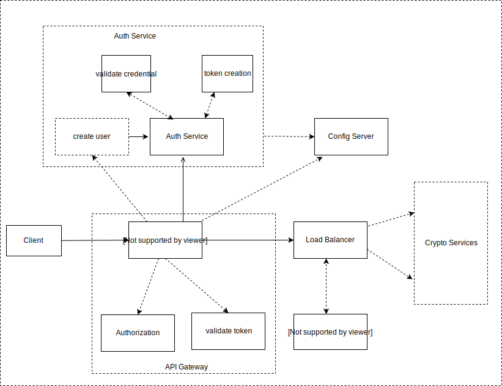

# playing-with-microservices-using-crypto-operations
In this i am trying to perform crypto operations using microservices

# Description: 

In this project we will going to perform crypto operation using our crypto microservices. We will going to use
following things:

1) API Gateway (Zuul)         :   Gateway for all the services. All request must come here  
2) Load Balancer  (Ribbon)    :   Optimize usage of our sevices
3) Service Discovery (Eureka) :   For discovering our services
4) Spring cloud Config Server :   To store all common config 
5) Authentication using JWT   :   JWT for authentication
6) Database (mysql)           :   To store user credentials and roles using hibernate
7) Feign Client               :   To communicate with other microservices
8) Hystrix                    :   For Fault tolreance our services

Component of our project are: 

 

We will going to have all this component implemented step by step. 

# Authentication Service:  [a relative link](auth-service)

# Config Server:  [a relative link](config-server)

# Naming server:  [a relative link](service-discovery)

I will implement the rest part soon and will upload it.
